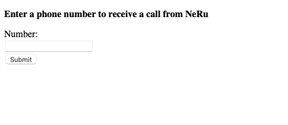

# Making an Outbound Call Using a Static Site, NeRu and the Voice API

## ❗❗❗ **This repo is now deprecated. Check the [Vonage Developer Blog](https://developer.vonage.com/en/blog) for more blog posts and tutorials. For more sample Vonage projects, check the [Vonage Community GitHub repo](https://github.com/Vonage-Community).**

This project shows how to use NeRu with a static HTML website, and make an outbound call with the Voice API.



## Running the project

To run the project after downloading/cloning, first install the dependencies:

```sh
npm install
```

Create a Vonage Application if you do not have one already, and [link a phone number](https://dashboard.nexmo.com) to the application:

```sh
neru app create --name "neru application"  
```

Then initialize NeRu, choosing an application, `nodejs16` for runtime, and `skip` for the template:

```sh
neru init
```

This will create a `neru.yml` file for you. In that file add the linked number under `environment`, `entrypoint` and the `debug` object:

```yml
project:
    name: vapi-outbound-static-app
instance:
    name: dev
    runtime: nodejs16
    region: aws.euw1
    application-id: $YOUR_VONAGE_APPLICATION_ID
    entrypoint: [node, index.js]
    capabilities:
        - voice
    environment:
        - name: VONAGE_NUMBER
          value: "$YOUR_VONAGE_NUMBER"
debug:
    name: debug
    entrypoint: [nodemon, --inspect, index.js]
```

Then start the project locally using:

```sh
neru debug
```
